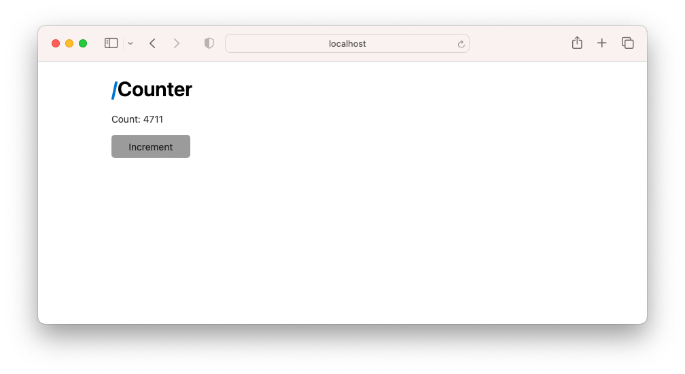
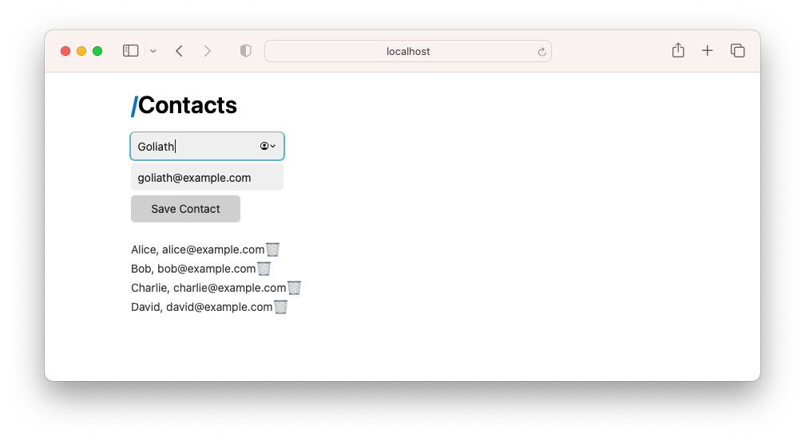
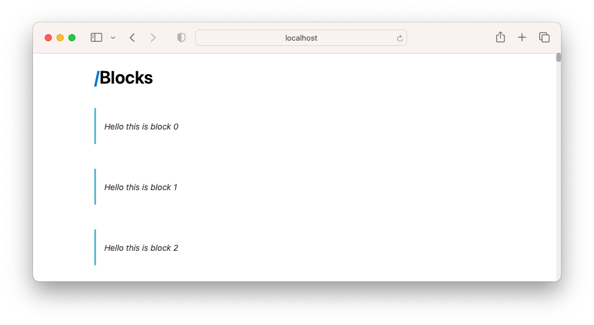
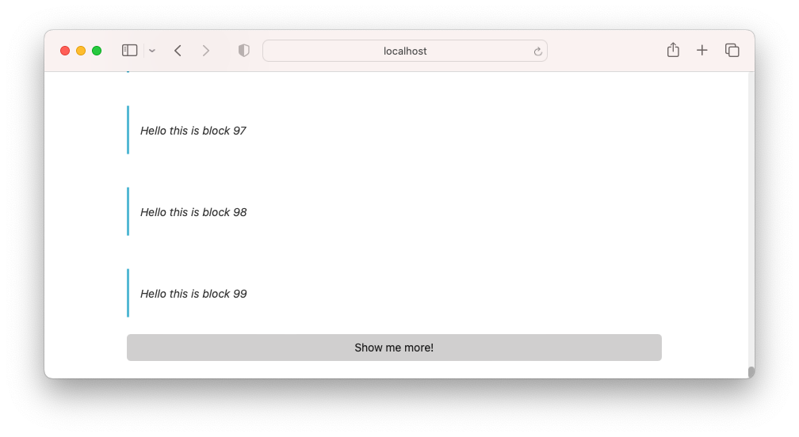

# HATEOAS

Trying out HTMX coding along with ["FULL Introduction To HTMX Using Golang" by FrontEnd Masters](https://www.youtube.com/watch?v=x7v6SNIgJpE)

Using [Water.css](https://watercss.kognise.dev).

### Counter


### Contacts book


### Scrolling blocks



## Requirements

* [Poly/ML] or [MLton]
* [smlpkg]

[Poly/ML]: https://www.polyml.org
[MLton]: http://mlton.org
[smlpkg]: https://github.com/diku-dk/smlpkg

## Building

A local build:
```
./build.sh
```

Build a container image:
```
./build.container.sh
```

## Running

A local build:
```
_build/hateoas
```

A container:
```
podman run --rm -it -p3000:3000 hateoas
```

To use the app, visit http://localhost:3000
